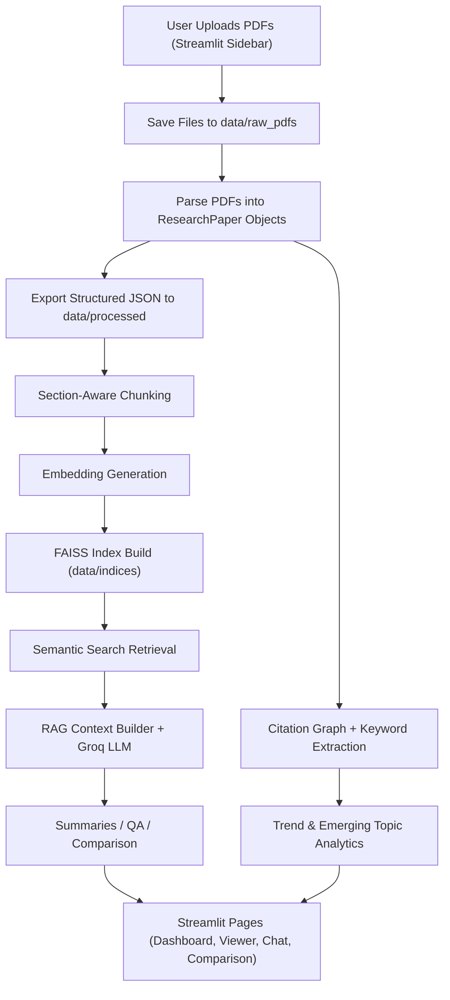
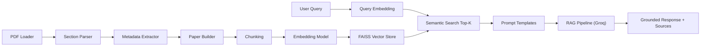

# Research Paper Management & Analysis Intelligence System

A production-style GenAI research assistant for ingesting academic PDFs, parsing them into structured sections, indexing them with FAISS for semantic retrieval, running grounded RAG workflows, and surfacing citation and trend intelligence through Streamlit.

## What This Project Does

This system helps researchers:
- ingest research PDFs from local upload
- parse section-level paper structure
- extract metadata and references
- build semantic search over paper sections
- generate grounded summaries and answers
- compare papers and methods
- build citation intelligence
- analyze trend and emerging topics
- explore all outputs in one Streamlit UI

## Actual Architecture Flow



## Processing and Retrieval Flow (Detailed)



## Core Features

### 1. Paper ingestion and parsing
- PDF loading with PyMuPDF (fitz)
- page-wise extraction and text cleanup
- section detection for abstract/introduction/methods/results/discussion/conclusion/references
- structured `ResearchPaper` output
- multi-file upload from UI

### 2. Semantic indexing
- section-aware chunking
- embedding generation (sentence-transformers provider)
- FAISS indexing and persistence
- metadata-aware semantic search

### 3. RAG research assistant
- paper summarization
- grounded question answering
- cross-paper comparison
- source-aware outputs
- Groq-backed generation via Streamlit secrets

### 4. Citation and trend intelligence
- citation graph construction (NetworkX)
- influential paper metrics
- keyword extraction
- trend aggregation by year/topic/venue
- emerging-topic detection

### 5. Streamlit research interface
- paper dashboard
- paper viewer
- research chat
- paper comparison
- citation explorer
- trend dashboard

## Project Structure

```text
research_ai/
  analytics/
  config/
  indexing/
  ingestion/
  models/
  parsing/
  rag/
  ui/
  utils/
app.py
run_streamlit_app.py
requirements.txt
README.md
```

## Important Files to Understand First

- `app.py`
  - root Streamlit entrypoint for deployment
- `research_ai/ui/app.py`
  - page routing, upload/process flow, session handling
- `research_ai/ui/backend.py`
  - UI-to-backend bridge (parse/index refresh, analytics snapshot, status)
- `research_ai/ingestion/pdf_loader.py`
  - PDF extraction pipeline
- `research_ai/parsing/section_parser.py`
  - academic section detection and references split
- `research_ai/indexing/vector_store.py`
  - FAISS lifecycle and retrieval storage
- `research_ai/indexing/semantic_search.py`
  - query-time semantic retrieval
- `research_ai/rag/rag_pipeline.py`
  - retrieval + context + LLM answer path
- `research_ai/analytics/citation_graph.py`
  - citation relationships and graph build
- `research_ai/analytics/trend_analysis.py`
  - topic growth and emerging trend logic

## Tech Stack

- Python
- Streamlit
- Pydantic
- PyMuPDF
- FAISS
- sentence-transformers
- Groq API
- NetworkX
- pandas
- numpy

## Setup

### 1. Install dependencies

```powershell
pip install -r requirements.txt
```

### 2. Configure Streamlit secrets

Create `.streamlit/secrets.toml`:

```toml
GROQ_API_KEY = "your_groq_api_key"
```

### 3. Run app

```powershell
streamlit run app.py
```

## Upload and Process Workflow

In the sidebar:
1. Upload one or more PDFs
2. Click `Process Uploaded PDFs`

System behavior:
- stores files in `data/raw_pdfs`
- parses into JSON under `data/processed`
- rebuilds FAISS index in `data/indices`
- shows chunk count summary for uploaded papers

## Streamlit Deployment

Deploy entrypoint:
- `app.py`

Why:
- `app.py` calls the real UI module in `research_ai/ui/app.py`
- gives a stable root deployment target for Streamlit Cloud

## Notes

- LLM features use `st.secrets["GROQ_API_KEY"]`.
